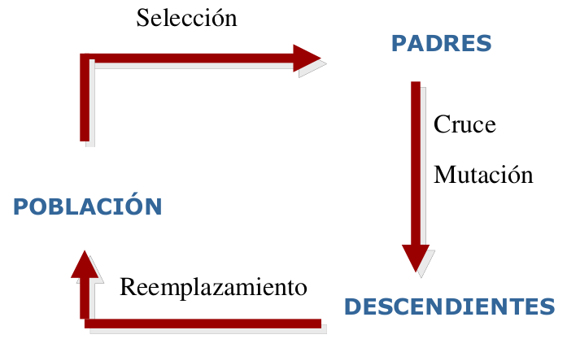

# Proyecto_Algoritmo_Genetico
Em este proyecto desarrollaremos un problema basado en la pregunta ¿Que pasaria si enun tablero de ajedrez pudieramos poner a lo mas una reina por cada fila y por cada columna? de la cual se desprende ¿Cuantas veces se atacaria con las de su alrededor?

Un algoritmo genetico es un algoritmo empleado en la optimizacion, busqueda y aprendizaje inspirado en los procesos de evolucion natural y evolucion genetica, y la idea detrasd de ellos es, _Teniendo una determinada poblacion de individuos que se enfrentan a diversas circunstancias en su entorno como estos se desarrollaran y como sera la supervivencia del mas apto_.

Los algoritmos geneticos constan de varias partes 
  1. Los individuos de la porblacion
  2. La seleccion de padres
  3. La reproduccion o cruza
  4. La mutacion
  5. Los descendientes
  6. El reemplacamiento

Este proceso es ilustrado en la siguiente imagen

Existen muchas tecnicas que podrian ser aplicadas a nuestro problema, pero en general nosotros trabajamos con las siguientes:

1. **Representacion de indiviiduos por vectores de permutacion**:
    Un vector de permutacion sera un _arreglo_ de valores naturales todos diferentes entre si. Para el estudio de nuestro problema se decidio esto pues pudimos darnos cuenta que si a cada entrada en el vector de permutacion le asignamos un numero de fila iniciando en el 0 y terminando en el 7, y cada entrada  del vector representa la columna en la que se encuentra la reina, seria muy facil uibicar la posicion de las reinas en el tablero

2. **Funcion de aptitud**: Esta funcion evaluara simplemente el numeros de ataques que una reina podria tener en contra de otra en cada diagonal posible dentro del tablero

3. **Funcion de seleccion de padres **:  Esta funcion es una ruleta por ponderacion de aptitud, que realiza una normalizacion de los valores _fitness_ de cada individuo y de manera abstracta en base a una tabla de variacion se evalua cada individuo, de modo que cada individuo puede ser elegido mas de una vez debido a que este es un  proceso mas al azar que tecnico la funcion arroja un arreglo formador por arreglos de parejas que son los padros

5. **Funcion de cruza**: El proceso de cruza se realiza por el metodo de cruza ciclica, este proceso se basa en jugar con los _alelos_ de cada vector de modo que el hijo generado sera abtenido a raiz de buscar el alelo en el padre no analizado hasta encontrarlo
  
6. **Funcion de mutacion**: El proceso de mutacion se realiza intercambiando elementos al azar en un un arreglo

7. **FUncion de reemplazo**: El reemplazo es elitista, se elige entre los individuos tanto de la generacion anterior como de la de los descendientes al mejor individuo o individuos hasta obtener una poblacion cada vez mas apta 
